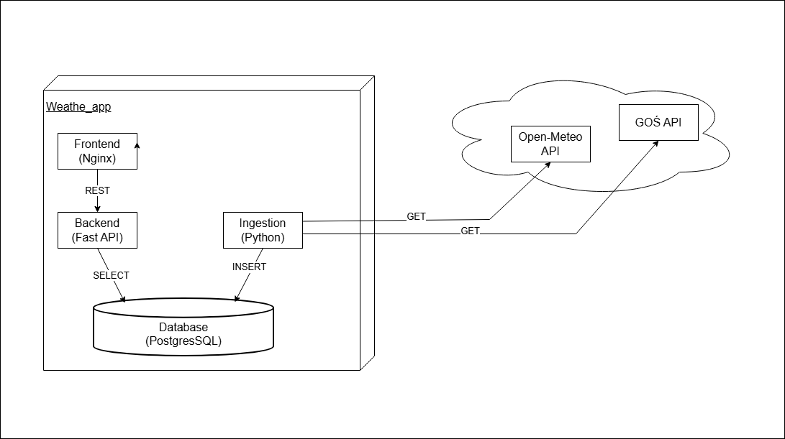
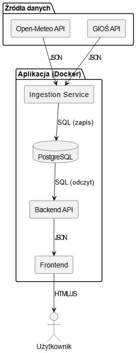
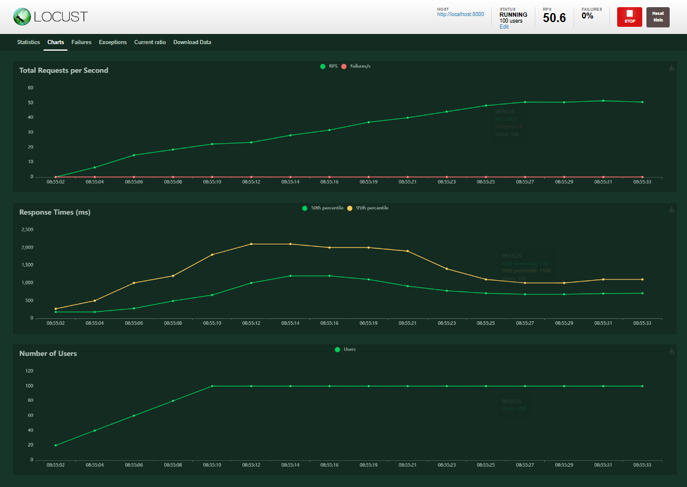

# Weather_app_IT_System_Architecture
The project was completed as part of the IT Systems Architecture course at Warsaw University of Technology.


## Autorzy
* **Karol Kacprzak** - [Karol315](https://github.com/Karol315)
* **Mateusz Jamroż** - [matjamroz](https://https://github.com/matjamroz)


Projekt zrealizowany w ramach przedmiotu Architektura Systemów Informatycznych na Politechnice Warszawskiej. Jest to kompletna, skonteneryzowana aplikacja internetowa dostarczająca aktualne informacje o pogodzie oraz jakości powietrza dla wybranych miast. System pobiera dane z zewnętrznych, otwartych interfejsów API (GIOŚ, Open-Meteo), przetwarza je w dedykowanym module typu worker (Ingestion), składuje w relacyjnej bazie PostgreSQL, a następnie serwuje za pośrednictwem backendu napisanego w FastAPI do interfejsu przeglądarkowego zbudowanego w oparciu o Nginx. Architektura zapewnia separację warstw, testowalność oraz łatwość wdrożenia dzięki wykorzystaniu narzędzia Docker Compose.

## Architektura Systemu



---

## Instrukcja Uruchomienia

### 1. Pobranie projektu
Sklonuj repozytorium na swoją maszynę lokalną lub serwer i przejdź do katalogu głównego projektu:

```Bash
git clone [LINK_DO_TWOJEGO_REPOZYTORIUM]
cd Weather_app_IT_System_Architecture/weather_app
```

### 2. Uruchomienie aplikacji głównej (Produkcja)
Aby uruchomić wszystkie usługi w tle:

```Bash
docker-compose up --build -d
```

Aplikacja będzie dostępna w przeglądarce pod adresem: http://localhost

Zatrzymanie aplikacji i czyszczenie bazy danych:

```Bash
docker-compose down -v
```
3. Zasilenie bazy danymi historycznymi (Backfill)
Wymaga uruchomionej aplikacji głównej. Aby pobrać historię z ostatnich 7 dni:

```Bash
docker-compose exec ingestion python backfill.py
```
4. Uruchomienie testów jednostkowych
Izolowane środowisko testowe. Aby uruchomić testy wewnątrz kontenerów:

```Bash
docker-compose -f docker-compose.test.yml up --build --abort-on-container-exit
```
Czyszczenie po testach:

```Bash
docker-compose -f docker-compose.test.yml down -v
```
5. Uruchomienie testów wydajnościowych (Locust)
Wymaga uruchomionej aplikacji głównej (krok 2). Uruchomienie panelu testowego:

```Bash
cd backend
python3 -m venv venv
source venv/bin/activate
pip install -r requirements.txt
pip install locust
locust -f locustfile.py --host=http://localhost:8000
```
Panel Locusta dostępny jest pod adresem: http://localhost:8089

Wyniki testu obciążeniowego:


 
